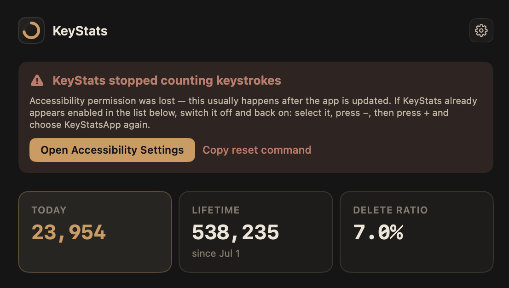

# KeyStats

A menu-bar-only macOS app that tracks your keystrokes locally and shows you
juicy stats about them. Nothing leaves your machine — it's a local SQLite file at
`~/Library/Application Support/KeyStats/keystats.sqlite`, no networking code
exists in the app at all.

## What it tracks

- **Per-key counts** — which letters/keys you press most (A, S, Backspace, etc.)
- **Modifier key usage** — how often you hit Cmd, Shift, Option, Control, Fn on their own
- **Keybind / combo usage** — e.g. `Cmd+Tab`, `Cmd+S`, `Control+C`, `Cmd+Shift+Z`,
  counted as canonical combos regardless of press order
- **Hourly activity** — bar chart of keystrokes for the last 24 hours, useful for
  spotting your most productive coding hours
- **Per-app activity** — which app was frontmost when you were typing (handy to
  see how much time goes to your editor vs. terminal vs. Slack)
- **Daily totals + backspace ratio** — rough proxy for how much you're
  correcting yourself while coding
- **Daily goal + streak** — a progress ring against a daily keystroke goal
  (15,000 by default), and a streak of consecutive days you've hit it. Once
  a day is credited it stays credited even if you change the goal later —
  see "Customizing it" below for how to change the goal itself

It intentionally does **not** store the sequence/content of what you typed —
only aggregate counts. That keeps it useful without turning into an actual
keylogger that could leak passwords if the DB were ever read by someone else.

## Requirements

- macOS 14+ (Sonoma or later — needed for the `SectorMark` pie chart in the dashboard)
- Xcode 15+ (for Swift 5.9 toolchain) — either Xcode itself, or just the
  Command Line Tools (`xcode-select --install`) if you'd rather build from
  the terminal with `swift build`.

## Running it

There's no downloadable build yet (see "Getting a real `.app`" below), so for
now you build it yourself. Two ways to do that:

### Option A — the packaged `.app` (recommended)

This builds a real `/Applications/KeyStatsApp.app`, the same way a
downloadable release eventually will work: proper menu bar icon, survives
reboots, and — unlike ad-hoc builds — keeps its Accessibility permission
across rebuilds.

```bash
cd KeyStats
./make-signing-cert.sh   # one-time per machine: creates a local "KeyStats Local Signing"
                         # identity in your keychain, so rebuilds don't lose Accessibility
                         # permission (ad-hoc signing has no stable identity, so macOS keys
                         # the grant to the binary's hash, which changes on every build)
./build-app.sh           # builds, signs, installs to /Applications, and launches it
```

Re-run `./build-app.sh` any time you pull new changes — it's idempotent,
backs up the SQLite database first, and quits/relaunches the running app for
you. `./make-signing-cert.sh` only ever needs to run once (it's a no-op if
the identity already exists); the one exception is the very first time you
switch an existing ad-hoc install over to this signed one, which still needs
one final manual Accessibility re-grant.

### Option B — quick dev loop

```bash
cd KeyStats
swift build -c release
swift run -c release
```

Or open the folder in Xcode (`File > Open` on `Package.swift`) and hit Run.
Faster to iterate with, but permission tends to attach to the parent process
(`Terminal`/`Xcode`) rather than a stable app identity, so it's easy to lose
between runs — use Option A if you want the grant to actually stick.

### Accessibility permission

macOS requires Accessibility permission for any app that wants to observe
keystrokes globally (this is the same permission used by apps like Rectangle
or Karabiner). On first launch a system prompt appears — click **Open System
Settings**, go to **Privacy & Security → Accessibility**, and enable the
toggle for **KeyStats** (or `Terminal`/`Xcode` if running via `swift run`).
The app polls for permission every 2 seconds and starts capturing
automatically once granted — no need to relaunch.

If permission is ever lost or was never granted, the dashboard shows a
banner, the menu bar icon changes, and Preferences → General shows the
status live — each with a button straight to the Accessibility pane and, if
needed, instructions to remove and re-add KeyStats there:



### Using it

The app has no Dock icon — look for the keyboard icon in your menu bar.
Click it → **Open Dashboard** to see your stats, **Preferences…** for theme/
goal settings, or **Quit KeyStats** to stop tracking and exit. The dashboard's
gear icon opens the same Preferences window.

Preferences has a General tab (Accessibility permission status, with the
same "Open Accessibility Settings" button as the dashboard banner), an
Appearance tab (11 dark themes, click a card to switch — same list as
`znotes/themes.json`), and a Goals tab (daily goal slider + presets, and a
"count weekends toward streak" toggle, off by default so a quiet Saturday or
Sunday can't break a streak built on weekdays). Changing the goal only ever
affects *today* — past days keep whatever `goal_met` they were written with,
permanently; raising the goal above what you've already typed today un-earns
just today's credit, and lowering it back re-earns it.

## Customizing it

Every tunable number in the app — window size, the daily goal's default/
range/presets, refresh intervals, chart sizing, query limits — lives in one
file, `Sources/KeyStats/AppConfig.swift`. Edit a constant there and rebuild
rather than hunting a number down across files.

The daily goal and weekend toggle are also reachable via `defaults write` if
you'd rather script it than use Preferences:

```bash
defaults write com.joby.KeyStatsApp dailyGoal 20000
defaults write com.joby.KeyStatsApp countWeekendsTowardStreak -bool true

# back to the defaults (15,000 / weekends don't count)
defaults delete com.joby.KeyStatsApp dailyGoal
defaults delete com.joby.KeyStatsApp countWeekendsTowardStreak
```

(If you're running via `swift run` rather than the packaged `.app`, these
land in a different `defaults` domain — the SwiftPM executable's, not
`com.joby.KeyStatsApp` — since they're keyed by bundle identifier.)

## Notes on accuracy / extending it

- The keycode → name map in `KeyCodeMap.swift` covers a standard US ANSI
  keyboard. If you use a different layout, some keys may show as `Key#NN` —
  just add the missing codes to the map.
- Combos are canonicalized in a fixed order (`Control+Option+Shift+Cmd+Fn+Key`)
  so `Shift+Cmd+Z` and `Cmd+Shift+Z` count as the same keybind.
- If you'd rather not track which app is frontmost (e.g. for extra privacy),
  delete the `recordFrontmostApp()` calls in `EventTapManager.swift`.
- To reset all stats, quit the app and delete
  `~/Library/Application Support/KeyStats/keystats.sqlite`.
- If you need to change the SQLite schema, don't edit the `CREATE TABLE`
  statements directly — `Storage.swift` has a numbered-migration system
  (`migrate()`/`addColumnIfMissing`) specifically so an update doesn't break
  installs that already have data. See the comment block above `migrate()`
  for the rules (append-only steps, always provide a `DEFAULT` for `NOT
  NULL` columns).

## Getting a real `.app` without building it yourself

There's no downloadable release yet — for now, building it yourself via
`./make-signing-cert.sh` + `./build-app.sh` (see "Running it" above) is the
only way to get the packaged `.app`. A proper downloadable build (signed
with a real Developer ID and notarized, rather than the local self-signed
identity these scripts use) is something I'd like to put together
eventually — hopefully stay tuned.
